<p align="center">
  <strong>Zukuk</strong>
</p>

<p align="center">
  Un forum bien-etre, entraide et sante mentale, construit en Go et Vanilla JavaScript.
</p>

<p align="center">
  
  
  
  
</p>

---

# Zukuk

**Zukuk** est un espace web d'entraide, de bien-etre et de sante mentale pense pour accueillir les discussions sensibles avec douceur, clarte et respect.

On peut y poster une discussion, reagir, commenter, suivre son humeur, rejoindre des activites, decouvrir des membres, recevoir des notifications et personnaliser son experience. L'objectif est simple : offrir une plateforme humaine, rassurante et techniquement propre, ou chacun peut venir parler, lire, soutenir ou simplement respirer.

Le projet repose sur un backend **Go**, une base **SQLite**, un frontend **HTML/CSS/Vanilla JS**, et une architecture volontairement lisible. Pas de surcouche inutile : chaque fichier a un role clair, chaque fonctionnalite reste proche du produit.

> Zukuk, c'est la rencontre entre un forum d'entraide, un carnet d'humeur, une communaute bienveillante et une base technique qui sait ou elle va.

## Table Des Matieres

- [Experience Produit](#experience-produit)
- [Pourquoi Zukuk ?](#pourquoi-zukuk-notre-vision)
- [Galerie Des Captures](#galerie-des-captures)
- [Fonctionnalites](#fonctionnalites)
- [Stack Technique](#stack-technique)
- [Architecture](#architecture)
- [Installation Locale](#installation-locale)
- [Configuration](#configuration)
- [Base De Donnees Et Seeder](#base-de-donnees-et-seeder)
- [Routes Principales](#routes-principales)
- [Securite](#securite)
- [Roadmap](#roadmap)
- [Philosophie](#philosophie)

<a id="pourquoi-zukuk-notre-vision"></a>

## 🌍 Pourquoi Zukuk ? (Notre Vision)

Dans un monde qui va de plus en plus vite, nous avons fait un constat simple et un peu triste : les véritables interactions humaines se réduisent de jour en jour. Il est devenu tellement plus facile, et parfois plus rassurant, de rester caché derrière nos écrans plutôt que de se parler à cœur ouvert.

Les écrans ont tendance à nous isoler, mais nous sommes convaincus qu'ils peuvent aussi nous rassembler si nous construisons les bons outils. **Zukuk n'est pas un réseau social de plus conçu pour scroller à l'infini.** C'est un refuge numérique. Un espace pensé pour que la technologie se mette au service de l'humain, de l'écoute, de la santé mentale et de la reconnexion, virtuelle d'abord, puis physique grâce aux activités locales.

Ce projet a été imaginé, designé et développé avec passion par une équipe de quatre personnes :

- **Edvige Houmasse**
- **Ryan Elqali**
- **Ilian Touazi**
- **Kerem Uysal**

Merci de faire vivre ce projet et de contribuer à un web plus humain. Prenez soin de vous ! 💙

## Experience Produit

Zukuk n'est pas seulement une liste de posts. C'est une experience sociale complete, construite autour de trois idees fortes :

| Pilier | Ce que Zukuk apporte |
| --- | --- |
| Ecoute | Des discussions, commentaires et profils publics pour creer du lien. |
| Expression | Un mode anonyme, des categories et un suivi d'humeur pour parler plus librement. |
| Action | Une carte d'activites, des inscriptions et des notifications pour transformer l'entraide en mouvement. |

Les interfaces utilisent des themes visuels, du glassmorphism et des typographies dynamiques pour donner a l'application une personnalite souple, presque organique, sans sacrifier la lisibilite.

## Galerie Des Captures

Tous les emplacements ci-dessous sont prets pour tes captures. Remplace simplement les chemins par tes fichiers, par exemple `docs/screenshots/board.png`.

### 1. Index - La Premiere Impression

La page d'atterrissage pose le ton : Zukuk est chaleureux, clair et oriente vers l'entraide.

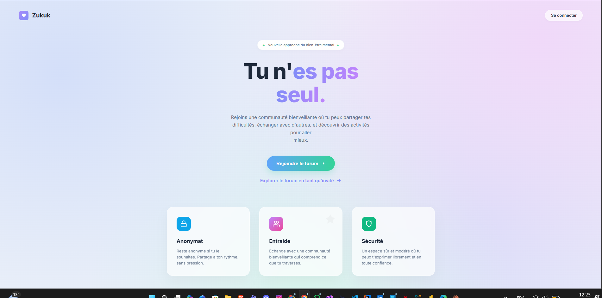

### 2. Inscription / Connexion - L'Entree Dans La Communaute

Creation de compte, connexion et recuperation d'acces : le parcours d'authentification doit rester fluide, rassurant et direct.

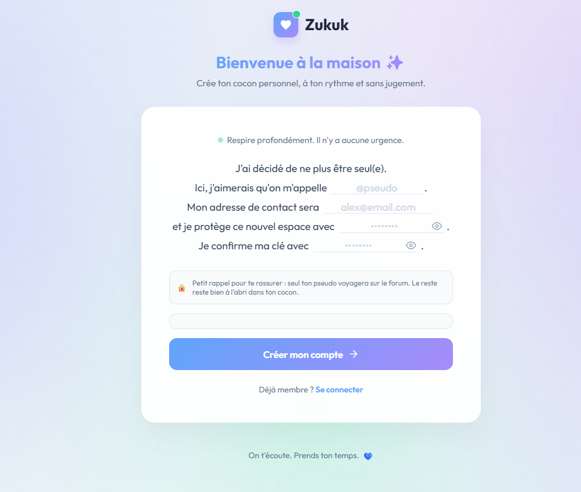

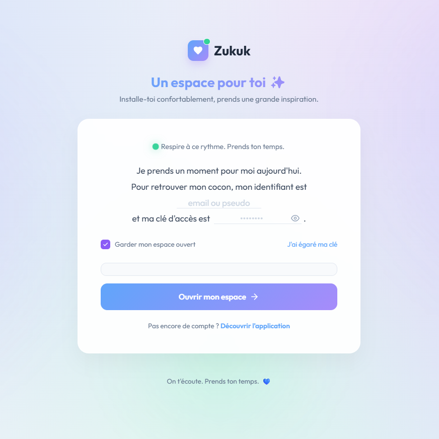

### 3. Board - Le Coeur Battant Du Forum

Le board rassemble les discussions, les categories, les filtres, les recherches, les statistiques et la creation de post.

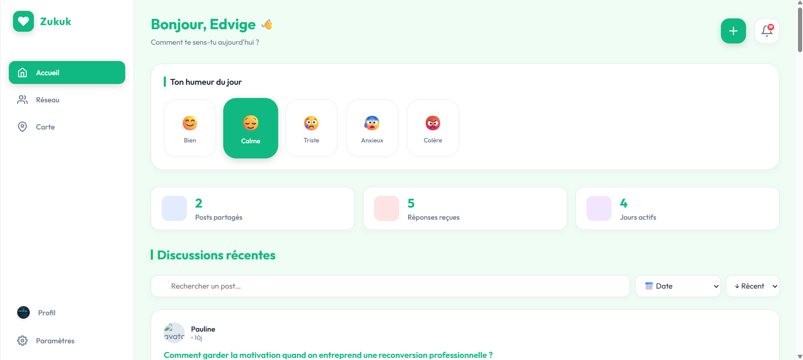

### 4. Changement D'Humeur - Le Selecteur Polymorphe

L'humeur choisie influence l'ambiance visuelle : couleurs, accents, fonds, sensations et parfois meme typographies.

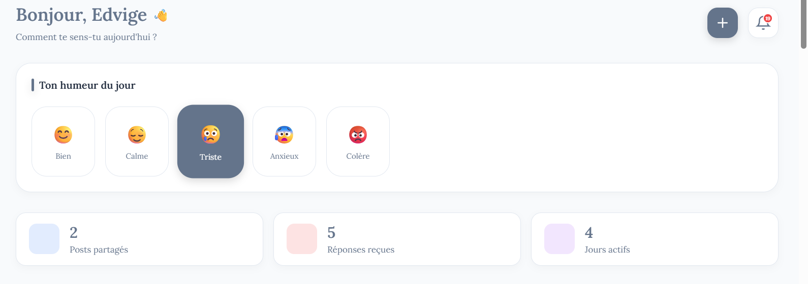

### 5. Detail D'Un Post - La Conversation En Profondeur

Chaque discussion dispose de sa page detaillee avec contenu, likes, commentaires, edition et suppression selon les droits.

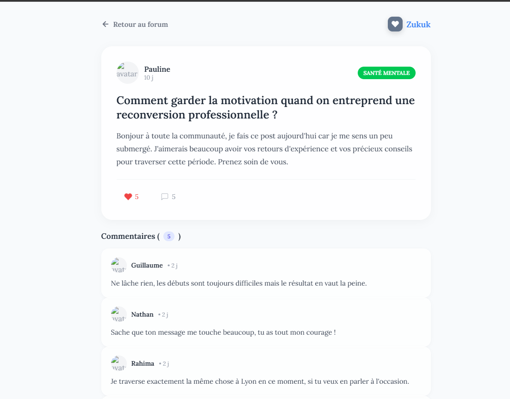

### 6. Reseau - La Communaute Visible

Le reseau permet de parcourir les membres, consulter les profils publics et retrouver les personnes actives sur la plateforme.

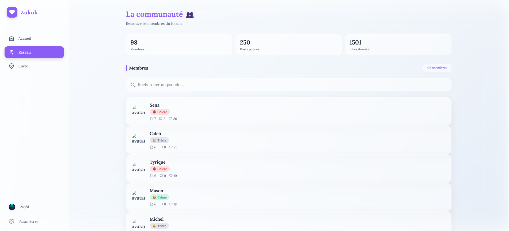

### 7. Notifications - Les Signaux Qui Comptent

Likes, commentaires et interactions importantes remontent dans un systeme d'alertes simple et utile.

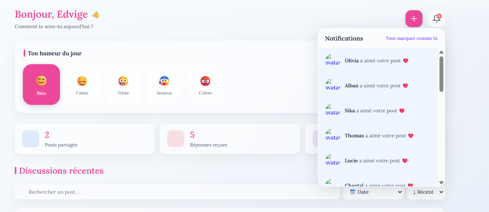

### 8. Carte - Les Activites Qui Sortent De L'Ecran

La carte transforme la communaute en actions concretes : activites, categories, inscriptions et participants.

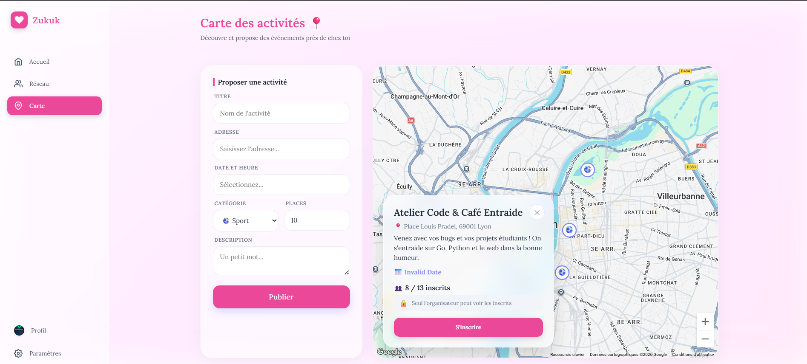

### 9. Profil - L'Espace Personnel

Le profil centralise les informations personnelles, l'avatar, la bio, les statistiques, l'activite et les actions sensibles.

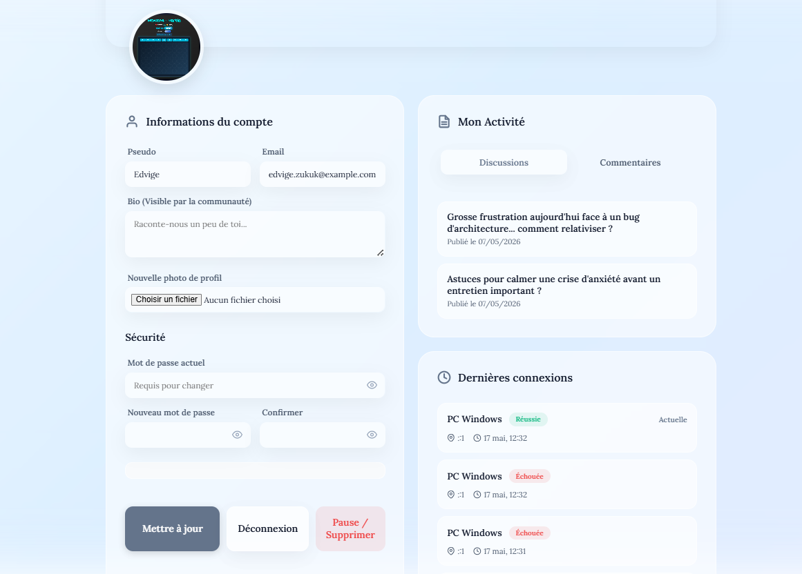

### 10. Settings - Le Centre De Controle

Parametres de compte, preferences d'anonymat, sessions, export des donnees, theme et pause du compte.

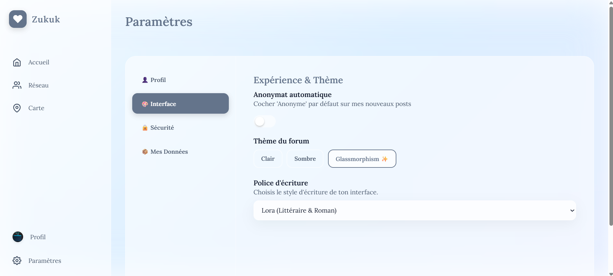

### 11. Theme Et Police - L'Identite Visuelle Vivante

Glassmorphism, theme clair, theme sombre, police automatique ou personnalisee : l'interface s'adapte a l'utilisateur.

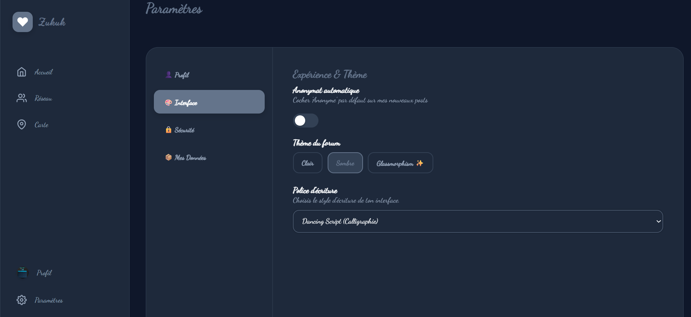

## Fonctionnalites

| Domaine | Fonctionnalites |
| --- | --- |
| Authentification | Inscription, connexion, deconnexion, sessions, mot de passe oublie. |
| Forum | Creation, lecture, edition et suppression de posts. |
| Commentaires | Ajout, edition, suppression et affichage par discussion. |
| Likes | Likes de posts, compteur et etat utilisateur. |
| Notifications | Alertes likes/commentaires et marquage en lu. |
| Anonymat | Publication et commentaire en mode anonyme. |
| Humeurs | Selection, historique, statistiques et impact visuel. |
| Profils | Profil personnel, profils publics, avatar, bio, activite. |
| Reseau | Annuaire communautaire et decouverte des membres. |
| Carte | Activites geolocalisees, creation, inscription, participants. |
| Settings | Preferences, theme, sessions, export, pause et suppression. |
| UI polymorphe | Themes light/dark/glass, humeurs et polices dynamiques. |

## Stack Technique

### Backend

| Technologie | Role |
| --- | --- |
| Go 1.25 | Langage principal du backend. |
| Gin | Routing HTTP et API REST. |
| SQLite | Stockage local simple, rapide et portable. |
| bcrypt | Hash robuste des mots de passe. |
| godotenv | Chargement de la configuration locale. |
| Middleware custom | Authentification, sessions et rate limiting. |

### Frontend

| Technologie | Role |
| --- | --- |
| HTML templates Go | Rendu des pages cote serveur frontend. |
| Vanilla JavaScript | Interactions, fetch API et logique client. |
| CSS modulaire | Styles separes par domaine fonctionnel. |
| data-theme | Gestion des themes visuels. |
| data-mood | Adaptation graphique selon l'humeur. |
| data-font | Typographies dynamiques. |

### Donnees

- Base SQLite locale : `database/zukuk.db`
- Tables creees automatiquement au lancement du backend
- Categories de posts et d'activites initialisees au demarrage
- Seeder realiste disponible pour generer une demo complete

## Architecture

Zukuk est organise comme une application web en **trois couches lisibles** : une interface servie par Go, une API REST en Gin, et une base SQLite locale. Le frontend reste volontairement leger, pendant que le backend concentre les regles metier, la securite et la persistance.

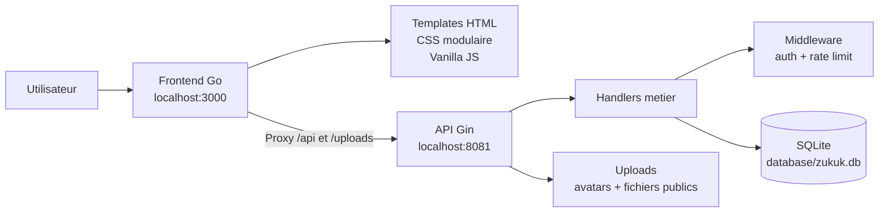

### Vue Des Couches

| Couche | Role | Dossiers |
| --- | --- | --- |
| Interface | Pages, interactions, themes, humeur, rendu utilisateur. | `frontend/html`, `frontend/css`, `frontend/js` |
| Serveur frontend | Templates Go, fichiers statiques, reverse proxy. | `frontend/server.go` |
| API | Auth, posts, commentaires, profil, settings, carte, notifications. | `api/server.go`, `api/handlers` |
| Transverse | Authentification, rate limit, validation, tokens, email. | `api/middleware`, `api/utils` |
| Donnees | Schema SQLite, initialisation, soft delete, seed categories. | `database/db.go`, `database/zukuk.db` |
| Demo | Jeu de donnees realiste pour tester l'application. | `seed.go` |

### Arborescence

```text
.
├─ api
│  ├─ handlers        # Modules metier : auth, board, posts, profil, settings...
│  ├─ middleware      # Garde d'entree : session, auth, rate limiting
│  ├─ utils           # Outils partages : mailer, tokens, validation
│  └─ server.go       # Bootstrap API Gin + routes publiques/protegees
│
├─ database
│  └─ db.go           # Connexion SQLite, schema, indexes, seeds systeme
│
├─ frontend
│  ├─ html            # Pages et partials reutilisables
│  ├─ css             # Design system, themes, pages, responsive
│  ├─ js              # Interactions Vanilla JS et appels API
│  └─ server.go       # Serveur web + proxy vers l'API
│
├─ seed.go            # Donnees de demo : users, posts, comments, likes, moods
├─ go.mod             # Module Go et dependances
└─ README.md          # Documentation projet
```

### Cycle D'Une Requete

```text
Navigateur
   |
   |  http://localhost:3000/board
   v
Frontend Go
   |
   |  sert board.html + board.css + board.js
   v
Vanilla JS
   |
   |  fetch /api/posts
   v
Reverse Proxy Frontend
   |
   |  http://localhost:8081/api/posts
   v
API Gin
   |
   |  handlers + middleware + SQLite
   v
Reponse JSON puis rendu dynamique dans la page
```

En local, le backend expose l'API sur `8081`. Le frontend tourne sur `3000`, sert les pages HTML, les assets CSS/JS et proxifie `/api/` ainsi que `/uploads/` vers le backend.

## Installation Locale

### 1. Prerequis

- Go installe
- Un environnement capable de compiler `github.com/mattn/go-sqlite3`
- Deux terminaux : un pour l'API, un pour le frontend

### 2. Installer Les Dependances

```bash
go mod download
```

### 3. Lancer Le Backend

Depuis la racine du projet :

```bash
go run ./api
```

L'API demarre par defaut sur :

```text
http://localhost:8081
```

Au premier lancement, la base `database/zukuk.db` est creee automatiquement.

### 4. Lancer Le Frontend

Dans un second terminal :

```bash
go run ./frontend
```

L'application est disponible sur :

```text
http://localhost:3000
```

### 5. Verifier Que Tout Repond

```bash
curl http://localhost:8081/api/health
```

Puis ouvre :

```text
http://localhost:3000
```

## Configuration

Zukuk peut tourner sans `.env` en local. Pour personnaliser les ports ou activer les emails de reinitialisation, ajoute un fichier `.env` a la racine :

```env
API_PORT=8081
FRONTEND_PORT=3000
FRONTEND_ORIGIN=http://localhost:3000

SMTP_HOST=smtp.example.com
SMTP_PORT=587
SMTP_USER=user@example.com
SMTP_PASS=password
SMTP_FROM=no-reply@example.com
```

| Variable | Defaut | Utilite |
| --- | --- | --- |
| `API_PORT` | `8081` | Port du serveur API. |
| `FRONTEND_PORT` | `3000` | Port du serveur frontend. |
| `FRONTEND_ORIGIN` | `http://localhost:3000` | Origine utilisee dans les liens email. |
| `SMTP_HOST` | vide | Serveur SMTP pour les emails. |
| `SMTP_PORT` | vide | Port SMTP. |
| `SMTP_USER` | vide | Identifiant SMTP. |
| `SMTP_PASS` | vide | Mot de passe SMTP. |
| `SMTP_FROM` | `SMTP_USER` | Adresse expediteur. |

> Note : le proxy du frontend pointe actuellement vers `http://localhost:8081`. Si tu modifies le port API, adapte aussi `frontend/server.go`.

## Base De Donnees Et Seeder

Au demarrage, le backend initialise les tables necessaires :

- utilisateurs, sessions et historique de mots de passe ;
- posts, commentaires, likes et notifications ;
- humeurs, historique et statistiques ;
- activites, categories et inscriptions ;
- preferences utilisateur ;
- journaux de suppression et moderation.

Pour generer une base de demonstration riche :

```bash
go run seed.go
```

Le seeder cree notamment :

- des utilisateurs de demonstration ;
- des discussions d'entraide ;
- des commentaires ;
- des likes ;
- des notifications ;
- des activites ;
- des historiques d'humeur.

Attention : `seed.go` nettoie plusieurs tables avant de reinjecter les donnees. Il est parfait pour une demo locale, pas pour une base contenant des donnees importantes.

## Routes Principales

### Pages Frontend

| Route | Page |
| --- | --- |
| `/` | Index |
| `/register` | Inscription |
| `/login` | Connexion |
| `/board` | Board |
| `/post/{id}` | Detail d'un post |
| `/network` | Reseau |
| `/profile` | Profil personnel |
| `/profile/{id}` | Profil public |
| `/carte` | Carte des activites |
| `/settings` | Parametres |
| `/forgot-password` | Mot de passe oublie |
| `/reset-password` | Reinitialisation |

### API Publique

| Methode | Endpoint |
| --- | --- |
| `GET` | `/api/health` |
| `GET` | `/api/board` |
| `GET` | `/api/quote` |
| `GET` | `/api/categories` |
| `GET` | `/api/posts` |
| `GET` | `/api/posts/:id` |
| `GET` | `/api/network` |
| `GET` | `/api/network/:id` |
| `GET` | `/api/activities` |

### API Protegee

| Methode | Endpoint |
| --- | --- |
| `GET` | `/api/me` |
| `PUT` | `/api/me` |
| `DELETE` | `/api/me` |
| `POST` | `/api/me/avatar` |
| `POST` | `/api/mood` |
| `POST` | `/api/posts` |
| `PUT` | `/api/posts/:id` |
| `DELETE` | `/api/posts/:id` |
| `POST` | `/api/posts/:id/like` |
| `POST` | `/api/posts/:id/comments` |
| `PUT` | `/api/comments/:id` |
| `DELETE` | `/api/comments/:id` |
| `GET` | `/api/notifications` |
| `POST` | `/api/notifications/read` |
| `POST` | `/api/activities` |
| `POST` | `/api/activities/:id/join` |
| `DELETE` | `/api/activities/:id` |
| `GET` | `/api/settings/` |
| `PUT` | `/api/settings/` |
| `GET` | `/api/settings/sessions` |
| `POST` | `/api/settings/sessions/revoke` |
| `GET` | `/api/settings/export` |

## Securite

Zukuk integre deja plusieurs bases serieuses :

- mots de passe hashes avec bcrypt ;
- sessions stockees en base ;
- cookies securisables en mode release ;
- separation entre endpoints publics et proteges ;
- rate limiting sur les routes sensibles ;
- validation cote backend ;
- soft delete avec journalisation ;
- anonymat configurable ;
- export des donnees utilisateur ;
- suppression ou pause de compte.

Avant une mise en production, prevoir :

- HTTPS obligatoire ;
- CORS plus restrictif ;
- secrets hors depot ;
- sauvegardes SQLite ;
- politique de moderation formelle ;
- logs applicatifs structures ;
- tests automatises sur auth, posts, comments, settings et notifications.

## Roadmap

| Priorite | Idee |
| --- | --- |
| Haute | Tests unitaires et integration API. |
| Haute | Pagination avancee sur le board et le reseau. |
| Moyenne | Recherche plein texte sur les discussions. |
| Moyenne | Signalements et moderation enrichie. |
| Moyenne | Notifications temps reel avec SSE ou WebSocket. |
| Basse | Deploiement Docker avec volume SQLite persistant. |
| Basse | Audit accessibilite complet. |

## Philosophie

Zukuk veut etre simple sans etre simpliste, doux sans etre fragile, fun sans perdre en precision.

Le produit parle a des humains. Le code, lui, reste suffisamment clair pour etre repris, maintenu et ameliore. C'est cette tension qui fait le charme du projet : une interface qui accueille, une architecture qui tient, et une communaute qui peut grandir dessus sans que tout parte en vrille.

---

<p align="center">
  <strong>Zukuk</strong><br>
  Parler. Soutenir. Respirer. Recommencer.
</p>
